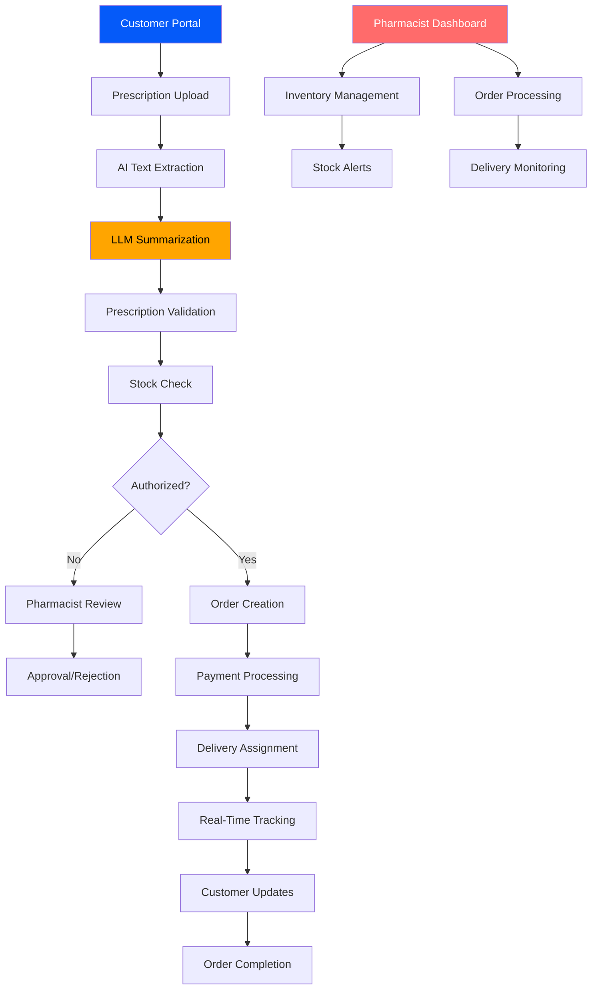

# 🏥 **NexPharma** - Complete Pharmacy Management System

[](https://nodejs.org/)
[](https://reactjs.org/)
[](https://www.mongodb.com/)
[](https://expressjs.com/)
[](https://openai.com/)
[](LICENSE)

> **🏆 PCCOE Hackathon - HM018**  
> A revolutionary digital pharmacy ecosystem connecting customers, pharmacists, and delivery partners in a seamless, AI-powered workflow.

[WhatsApp Image 2026-01-18 at 00 50 23](https://github.com/user-attachments/assets/8c4e6f79-b434-420a-a089-375af8cc4263)

---

## 🌟 **Overview**

**NexPharma** is an end-to-end pharmacy management platform designed to modernize healthcare delivery. Built for the **PCCOE Hackathon (HM018)**, it transforms traditional pharmacy operations into a digital-first experience, ensuring safety, efficiency, and accessibility for all stakeholders.

### 🎯 **Mission**

To create a secure, AI-enhanced pharmacy system that validates prescriptions digitally, manages inventory intelligently, and delivers medicines with real-time tracking – all while maintaining the highest standards of healthcare compliance.

---

## 🚀 **Key Features**

### 👨‍⚕️ **Pharmacist Dashboard**

- **📊 Digital Inventory Management**: Real-time stock tracking with automated alerts for low/critical levels
- **📈 Stock Monitoring**: Visual dashboards with expiry tracking and demand forecasting
- **🛒 Order Processing**: Streamlined order fulfillment with prescription validation
- **🚨 Smart Alerts**: Notifications for expiring medicines, stock shortages, and pending approvals
- **📋 Prescription Review**: AI-generated summaries for quick decision-making

### 🛍️ **Customer Portal**

- **🔍 Intelligent Medicine Search**: Advanced search with autocomplete and category filters
- **📤 Prescription Upload**: Secure file upload with AI-powered text extraction (PDF/Image)
- **🛒 Seamless Order Placement**: One-click ordering with prescription validation
- **👤 Refill Profile Management**: Automated refill reminders and prescription history
- **💳 Secure Payments**: Multiple payment options with order tracking

### 🚚 **Delivery Tracking System**

- **📍 Real-Time Tracking**: GPS-enabled delivery updates for customers and pharmacists
- **📱 Live Status Updates**: Order status from "Placed" to "Delivered" with timelines
- **👥 Multi-Stakeholder Access**: Customers track orders, pharmacists monitor deliveries
- **📞 Integrated Communication**: Direct messaging between customers and delivery partners

### 🔐 **Prescription Validation & Order Authorization Module**

- **🤖 AI-Powered Extraction**: OCR and PDF parsing for automatic medicine detection
- **📝 LLM Summarization**: OpenAI-generated summaries for pharmacist review
- **✅ Digital Verification**: Automated stock checking and authorization workflows
- **🔗 Seamless Integration**: Direct connection to order processing and delivery systems
- **🛡️ Compliance Assurance**: Ensures only authorized medicines are dispensed

---

## 🏗️ **System Architecture**



---

## 🛠️ **Tech Stack**

### **Frontend**

- ⚛️ **React 18** - Modern UI components with hooks
- 🎨 **Styled Components** - Custom theming and responsive design
- 🌐 **Axios** - HTTP client for API communication
- 🧭 **React Router** - Client-side routing
- 📱 **Responsive Design** - Mobile-first approach

### **Backend**

- 🚀 **Node.js** - Runtime environment
- 📡 **Express.js** - RESTful API framework
- 🍃 **MongoDB** - NoSQL database with Mongoose ODM
- 🔐 **JWT** - Authentication and authorization
- ☁️ **Cloudinary** - File storage and management

### **AI & ML**

- 🤖 **OpenAI GPT-3.5** - Prescription summarization
- 📷 **Tesseract.js** - OCR for image processing
- 📄 **pdf-parse** - PDF text extraction

### **DevOps & Tools**

- 🐳 **Docker** (Optional) - Containerization
- 📦 **Nodemon** - Development server
- 🔒 **Helmet** - Security middleware
- 📊 **Morgan** - Request logging

---

## 📦 **Installation & Setup**

### **Prerequisites**

- Node.js 18+
- MongoDB Atlas account
- OpenAI API key
- Cloudinary account

### **Clone & Install**

```bash
git clone https://github.com/Rishabh-0615/HM018_THERESTFULCODERS.git
cd HM018_THERESTFULCODERS

# Install backend dependencies
cd backend
npm install

# Install frontend dependencies
cd ../frontend/client
npm install
```

### **Environment Configuration**

Create `.env` file in project root:

```env
PORT=5005
MONGO_URL=your_mongodb_connection_string
JWT_SEC=your_jwt_secret
OPENAI_API_KEY=your_openai_api_key
CLOUDINARY_URL=your_cloudinary_url
# ... other config
```

### **Run the Application**

```bash
# Start backend (from project root)
npm run dev

# Start frontend (from frontend/client)
npm start
```

---

## 📖 **Usage Guide**

### **For Customers**

1. **Register/Login** to access the portal
2. **Search Medicines** or upload prescription
3. **Validate Prescription** with AI extraction
4. **Place Order** with secure payment
5. **Track Delivery** in real-time

### **For Pharmacists**

1. **Login** to dashboard
2. **Review Pending Prescriptions** with AI summaries
3. **Approve/Reject** orders based on validation
4. **Manage Inventory** and monitor stock levels
5. **Track Deliveries** and customer communications

### **For Delivery Partners**

1. **Receive Assignments** via integrated system
2. **Update Status** in real-time
3. **Communicate** with customers and pharmacists

---

## 🔌 **API Endpoints**

### **Authentication**

- `POST /api/auth/register` - User registration
- `POST /api/auth/login` - User login
- `GET /api/auth/profile` - Get user profile

### **Prescriptions**

- `POST /api/prescriptions/upload` - Upload prescription with AI processing
- `GET /api/prescriptions/validate/:id` - Validate prescription stock
- `PUT /api/prescriptions/approve/:id` - Approve/reject prescription
- `GET /api/prescriptions/pending` - Get pending prescriptions (Pharmacist)

### **Medicines**

- `GET /api/medicines` - Search medicines
- `POST /api/medicines` - Add medicine (Admin)
- `PUT /api/medicines/:id` - Update stock

### **Orders**

- `POST /api/orders` - Create order
- `GET /api/orders/my-orders` - Get user orders
- `GET /api/orders/:id/track` - Track order status

---

## 🎨 **UI Screenshots**

### **Customer Portal**


### **Pharmacist Dashboard**


### **Order Tracking**


---

## 🤝 **Contributing**

We welcome contributions! Please follow these steps:

1. Fork the repository
2. Create a feature branch (`git checkout -b feature/amazing-feature`)
3. Commit changes (`git commit -m 'Add amazing feature'`)
4. Push to branch (`git push origin feature/amazing-feature`)
5. Open a Pull Request

### **Development Guidelines**

- Follow ESLint configuration
- Write comprehensive tests
- Update documentation
- Maintain code quality standards

---

## 👥 **Team**

- **Rishabh Sharma** - Pune Institute of Computer Technology
- **Pratik Chavan** - Pune Institute of Computer Technology
- **Dhruv Gardharia** - Pune Institute of Computer Technology
- **Sanket Shinde** - Pune Institute of Computer Technology

---

## 🙏 **Acknowledgments**

- PCCOE for hosting the hackathon
- OpenAI for AI capabilities
- MongoDB Atlas for database services
- Cloudinary for media management

---

## 📞 **Contact**

For questions or support:

- 📧 Email: sanketshinde1827@gmail.com
- 🐛 Issues: [GitHub Issues](https://github.com/Rishabh-0615/HM018_THERESTFULCODERS/issues)

---

<div align="center">

**Made with ❤️ for Healthcare Innovation**

⭐ Star this repo if you found it helpful!

</div>
